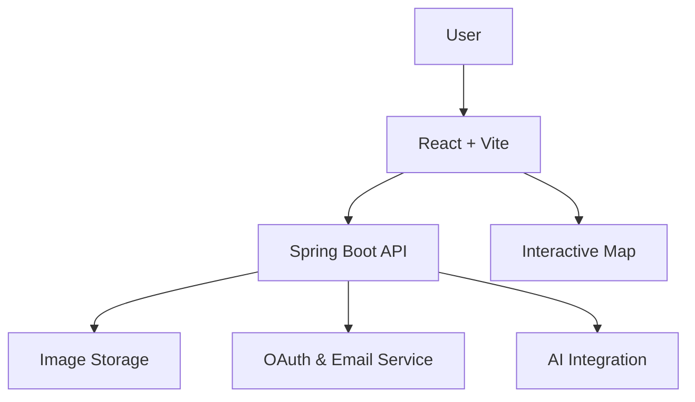

# 🌍 Atlas Frontend


> **Atlas** is an intelligent travel companion that helps users discover destinations, plan itineraries, and book experiences — all in one seamless platform powered by AI and Google Maps.

---

## 👩‍💻 Developer

**Luisa Cerin Ogbeiwi**

---

## 💡 Highlights

- Seamless Google OAuth authentication  
- Real-time interactive Google Maps integration  
- Integrated Supabase backend for image storage  
- Secure password recovery via email  
- Optimized build with Vite and Tailwind  
- Modern and responsive UI built from scratch

## 🌐 Live Demo

[atlas.vercel.app](https://atlas-works.vercel.app)

## 🧩 Related Projects

**[Atlas Backend (Java Spring Boot)](https://github.com/browny26/atlas-backend)**

---

## ✨ Features

- **User Authentication**: Sign up, login, password reset with Google OAuth integration
- **Flight Search**: Search and book flights with airport autocomplete
- **Itinerary Management**: Create and manage travel itineraries
- **Activity Booking**: Browse and book travel activities
- **Interactive Maps**: Google Maps integration for location visualization
- **User Dashboard**: Comprehensive user profile and booking management
- **Responsive Design**: Mobile-first, fully responsive UI with Tailwind CSS
- **Protected Routes**: Secure authentication and authorization

---

## 🛠 Tech Stack

- **Frontend Framework**: React 19.1.1
- **Build Tool**: Vite 7.1.2
- **Styling**: Tailwind CSS 4.1.13
- **UI Components**: Flowbite, Headless UI, Heroicons
- **Routing**: React Router DOM 7.9.1
- **Maps**: Google Maps API (@react-google-maps/api, @vis.gl/react-google-maps)
- **Authentication**: Google OAuth (@react-oauth/google)
- **Backend Integration**: Supabase 2.75.0
- **HTTP Client**: Axios 1.12.2
- **Date Handling**: date-fns 4.1.0
- **State Management**: React Context API

---

## 🚀 Getting Started

### Prerequisites

- Node.js (v16 or higher)
- npm or yarn
- Google Maps API Key
- Google OAuth Client ID
- Supabase Project

### Installation

1. Clone the repository:

```bash
git clone https://github.com/browny26/atlas-frontend.git
cd atlas-frontend
```

2. Install dependencies:

```bash
npm install
```

3. Create a `.env` file in the root directory and add your environment variables:

```env
VITE_GOOGLE_MAPS_API_KEY=your_google_maps_api_key
VITE_GOOGLE_CLIENT_ID=your_google_oauth_client_id
VITE_SUPABASE_URL=your_supabase_url
VITE_SUPABASE_ANON_KEY=your_supabase_anon_key
VITE_BE_URL=your_api_base_url
```

4. Start the development server:

```bash
npm run dev
```

5. Open your browser and navigate to `http://localhost:5173`

## 📁 Project Structure

```
atlas-frontend/
├── public/              # Static assets
├── src/
│   ├── assets/          # Images, icons, and other assets
│   ├── components/      # Reusable components
│   │   ├── auth/        # Authentication components
│   │   ├── header/      # Header components
│   │   └── ui/          # UI components (buttons, inputs, etc.)
│   ├── context/         # React Context providers
│   ├── hooks/           # Custom React hooks
│   ├── layout/          # Layout components
│   ├── pages/           # Page components
│   │   ├── home/
│   │   ├── about/
│   │   ├── services/
│   │   ├── adventure/
│   │   ├── login/
│   │   ├── signup/
│   │   ├── terms/
│   │   ├── privacy/
│   │   ├── forgot-password/
│   │   ├── reset-password/
│   │   ├── dashboard/
│   │   ├── flights/
│   │   ├── activities/
│   │   ├── itineraries/
│   │   └── profile/
│   ├── services/        # API services
│   ├── App.jsx          # Main App component
│   ├── main.jsx         # Entry point
│   └── index.css        # Global styles
├── eslint.config.js     # ESLint configuration
├── vite.config.js       # Vite configuration
├── package.json         # Project dependencies
└── README.md            # Project documentation
```

---

## 📜 Available Scripts

- `npm run dev` - Start development server
- `npm run build` - Build for production
- `npm run preview` - Preview production build
- `npm run lint` - Run ESLint

---

## 🔐 Environment Variables

The following environment variables are required:

| Variable                   | Description                               |
| -------------------------- | ----------------------------------------- |
| `VITE_GOOGLE_MAPS_API_KEY` | Google Maps API key for map functionality |
| `VITE_GOOGLE_CLIENT_ID`    | Google OAuth client ID for authentication |
| `VITE_SUPABASE_URL`        | Supabase project URL                      |
| `VITE_SUPABASE_ANON_KEY`   | Supabase anonymous key                    |
| `VITE_BE_URL`              | Backend API base URL                      |

---

## 🏗️ Architecture Overview

Atlas frontend communicates with the backend via REST APIs for authentication, data management, and AI requests.  
Supabase handles image storage, while Google APIs manage login and map services.



---

## 🤝 Contributing

Contributions and feedback are welcome!  
Feel free to open issues or suggest new features.

## 📄 License

This project is private and proprietary.
